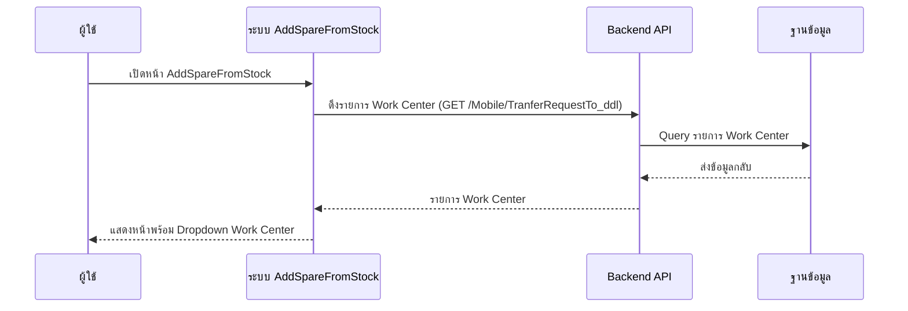
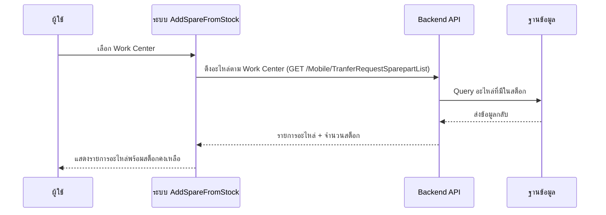
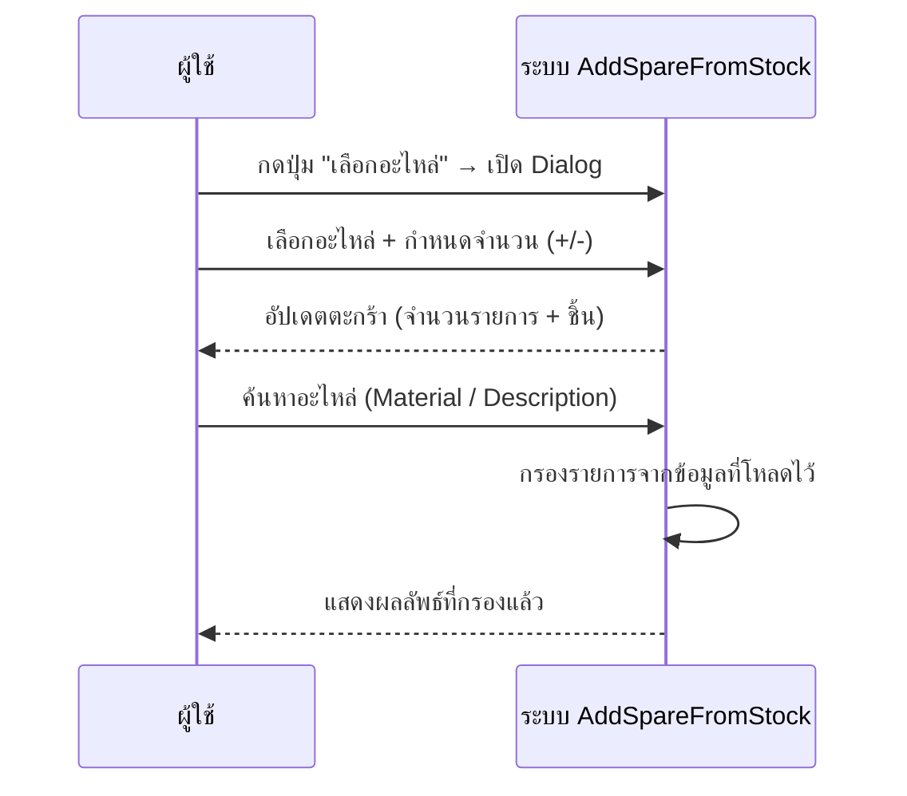
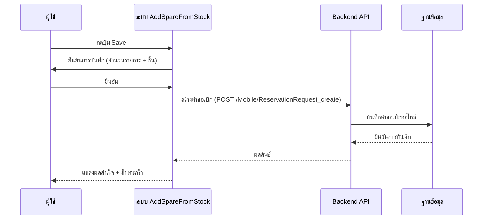

# AddSpareFromStock - Sequence Diagram (ภาพรวม)

## 1. เปิดหน้า + โหลดข้อมูล Work Center

---

## 2. เลือก Work Center → โหลดอะไหล่ในสต็อก

---

## 3. เลือกอะไหล่ใส่ตะกร้า

---

## 4. บันทึกคำขอเบิกอะไหล่ (Reservation Request)

