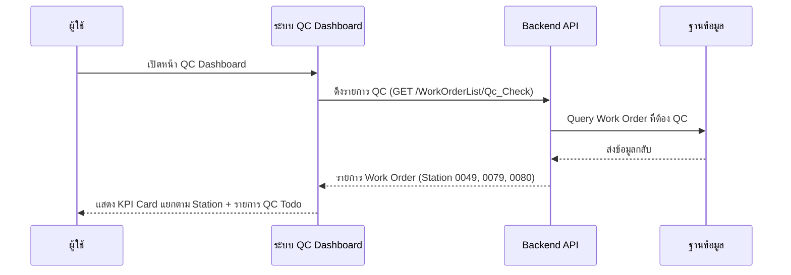
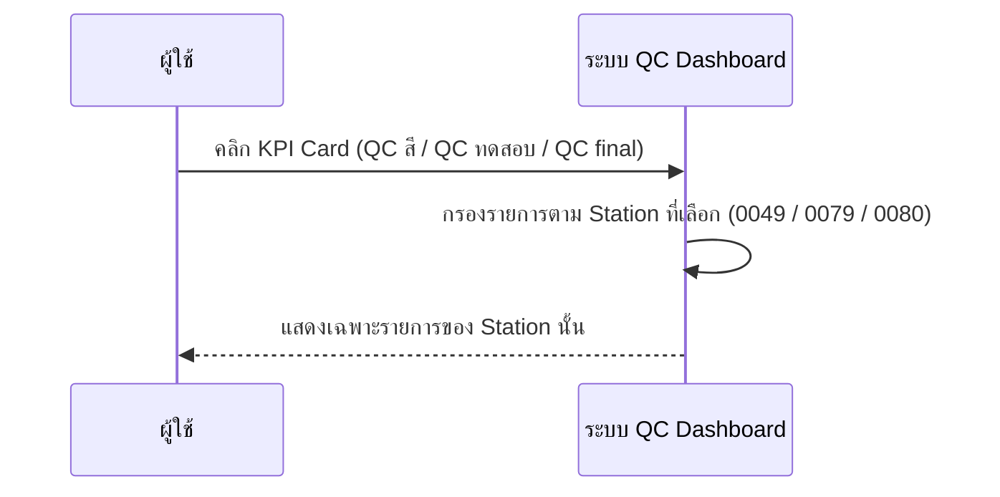
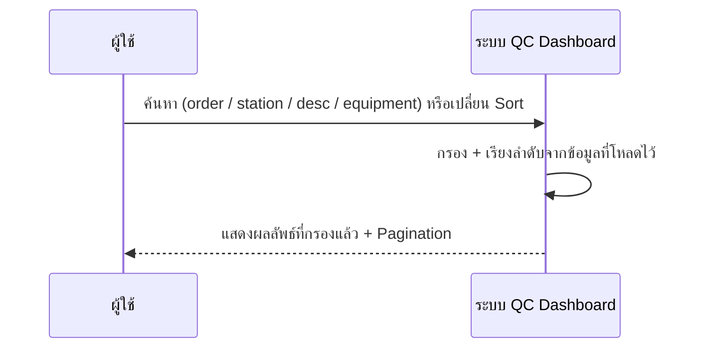
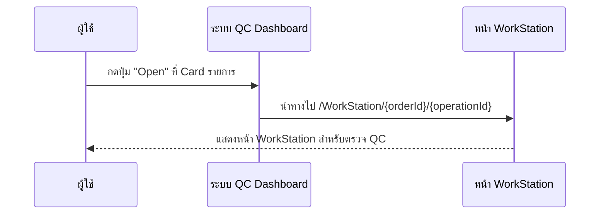

# DashboardQC - Sequence Diagram (ภาพรวม)

## 1. เปิดหน้า QC Dashboard (โหลดข้อมูล)

---

## 2. กรองตาม Station (KPI Card)

---

## 3. ค้นหาและเรียงลำดับ

---

## 4. เปิดรายละเอียด Work Order เพื่อตรวจ QC

