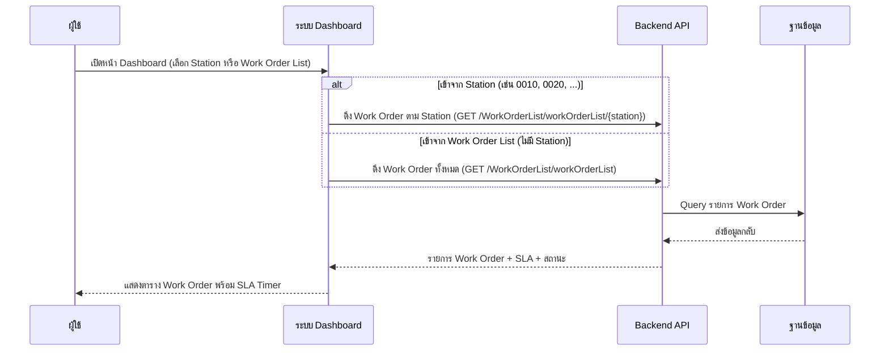
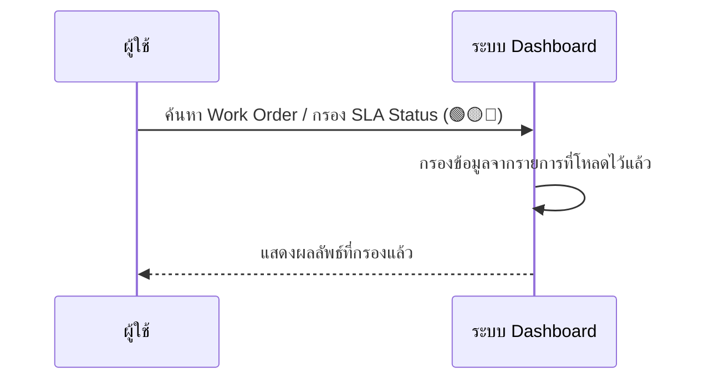
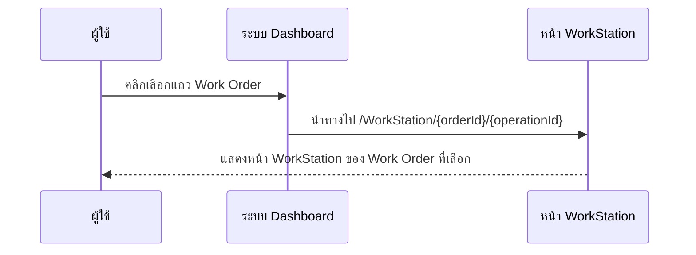
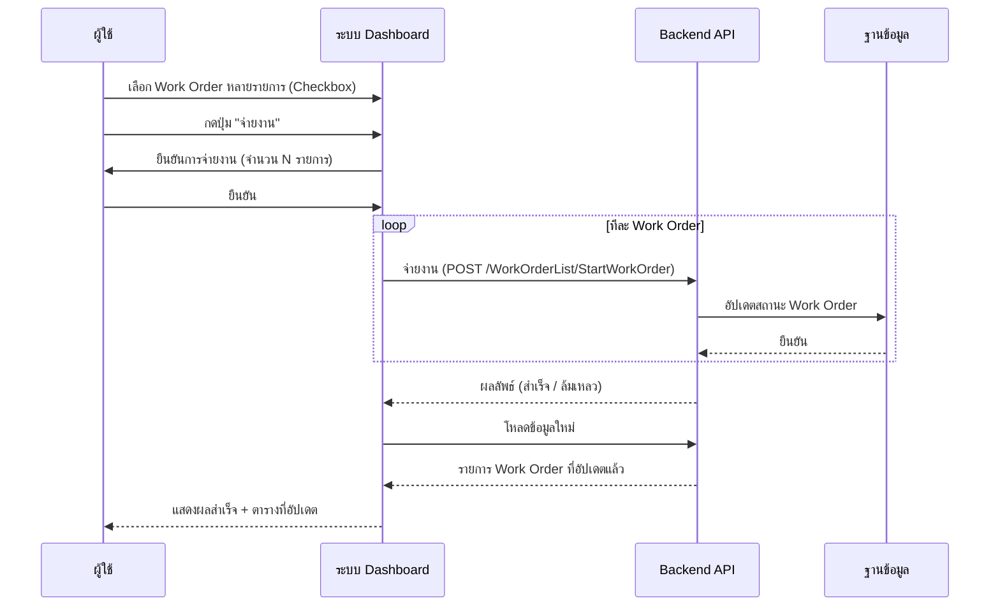

# DashboardRefurbish - Sequence Diagram (ภาพรวม)

## 1. เปิดหน้า Dashboard (โหลดข้อมูล Work Order)

---

## 2. ค้นหาและกรอง Work Order

---

## 3. เลือก Work Order เพื่อเข้าหน้า WorkStation

---

## 4. จ่ายงาน (Dispatch Work Orders) — เฉพาะโหมด Work Order List

