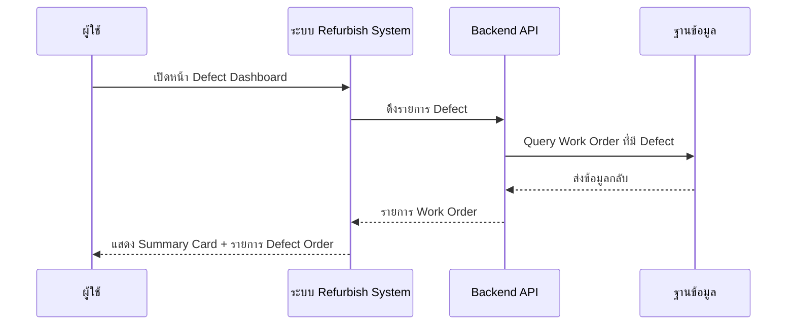
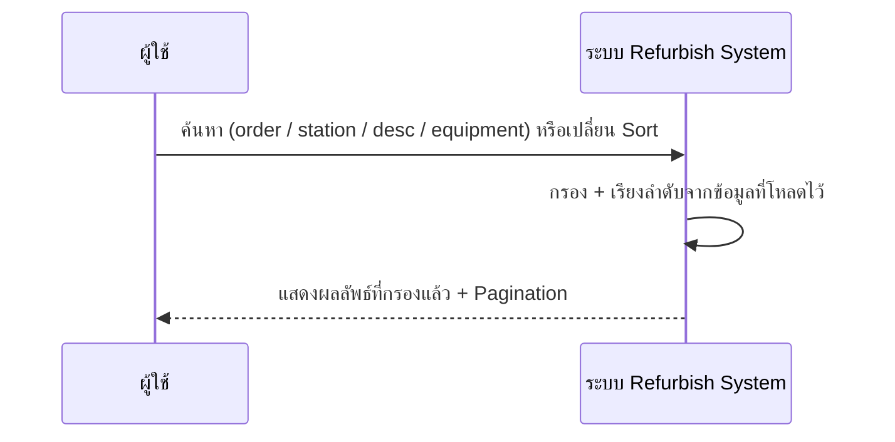
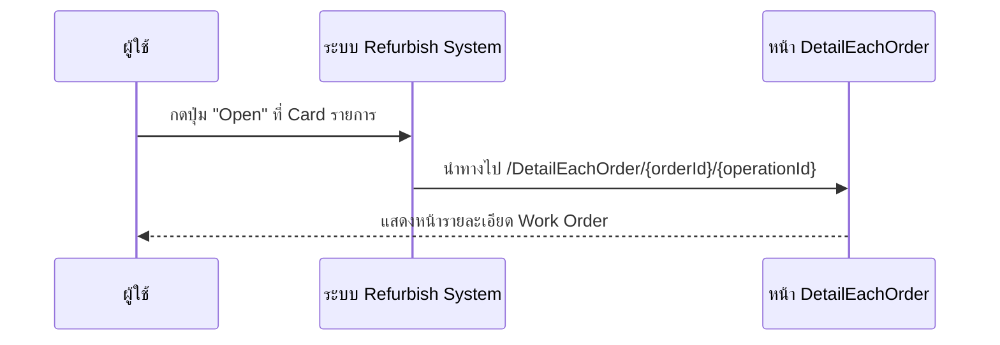
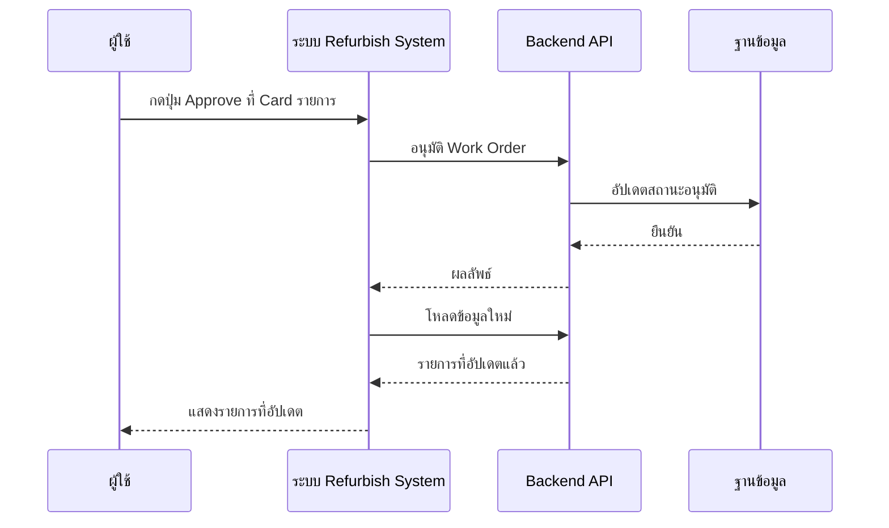
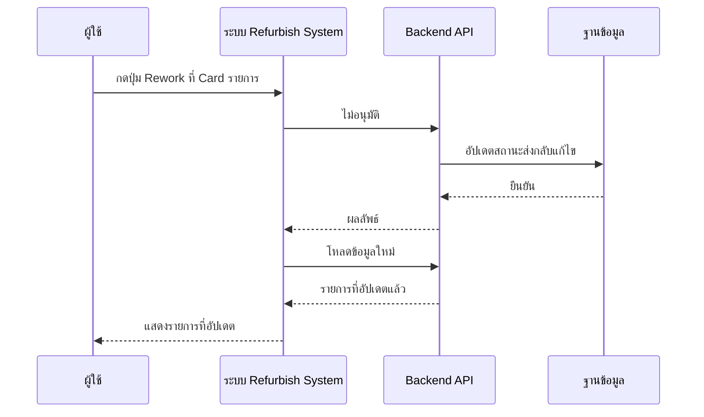

# DefectDashboard - Sequence Diagram (ภาพรวม)

## 1. เปิดหน้า Defect Dashboard (โหลดข้อมูล)

---

## 2. ค้นหาและเรียงลำดับ

---

## 3. เปิดรายละเอียด Work Order

---

## 4. อนุมัติ (Approve)

---

## 5. ส่งกลับแก้ไข (Rework / Not Approve)

