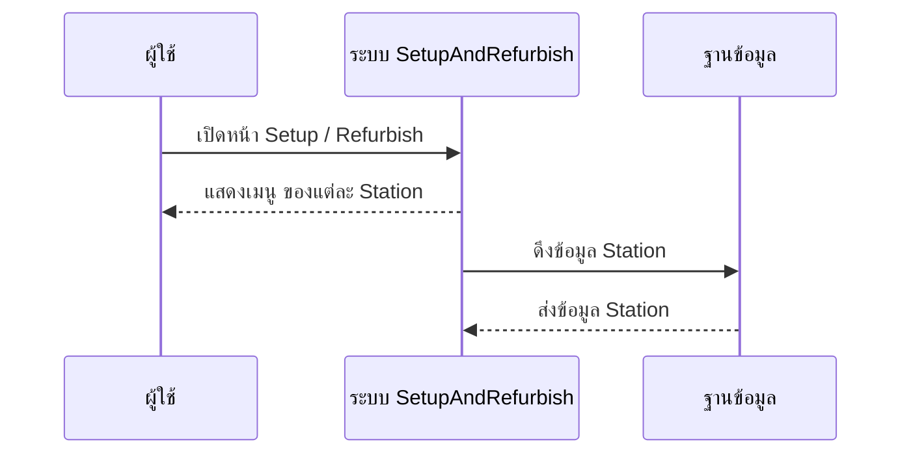
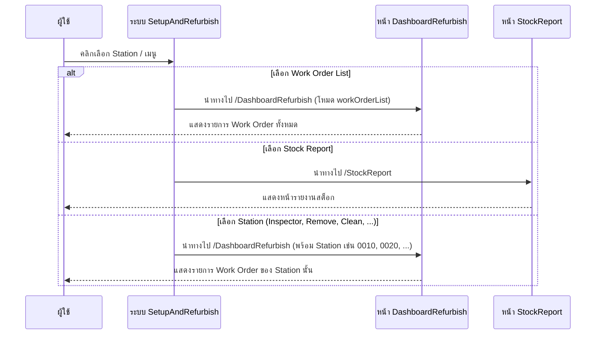

# SetupAndRefurbish - Sequence Diagram (ภาพรวม)

## 1. เปิดหน้า Setup / Refurbish (หน้าเลือก Station)

```mermaid
sequenceDiagram
    participant U as ผู้ใช้
    participant SR as ระบบ SetupAndRefurbish
    participant DB as ฐานข้อมูล

    U->>SR: เปิดหน้า Setup / Refurbish
    SR-->>U: แสดงเมนู ของแต่ละ Station
    SR->>DB: ดึงข้อมูล Station
    DB-->>SR: ส่งข้อมูล Station
```

---

## 2. เลือก Station หรือ Work Order List

```mermaid
sequenceDiagram
    participant U as ผู้ใช้
    participant SR as ระบบ SetupAndRefurbish
    participant DB as หน้า DashboardRefurbish
    participant STK as หน้า StockReport

    U->>SR: คลิกเลือก Station / เมนู
    alt เลือก Work Order List
        SR->>DB: นำทางไป /DashboardRefurbish (โหมด workOrderList)
        DB-->>U: แสดงรายการ Work Order ทั้งหมด
    else เลือก Stock Report
        SR->>STK: นำทางไป /StockReport
        STK-->>U: แสดงหน้ารายงานสต็อก
    else เลือก Station (Inspector, Remove, Clean, ...)
        SR->>DB: นำทางไป /DashboardRefurbish (พร้อม Station เช่น 0010, 0020, ...)
        DB-->>U: แสดงรายการ Work Order ของ Station นั้น
    end
```
