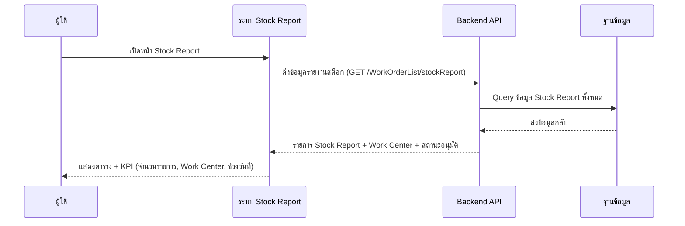
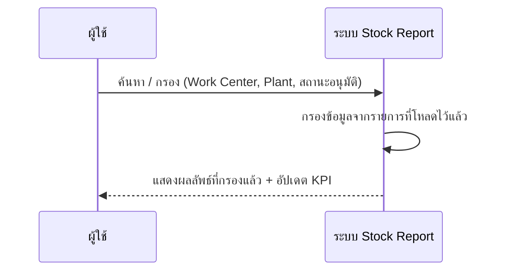
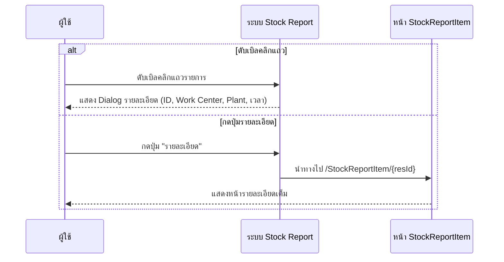
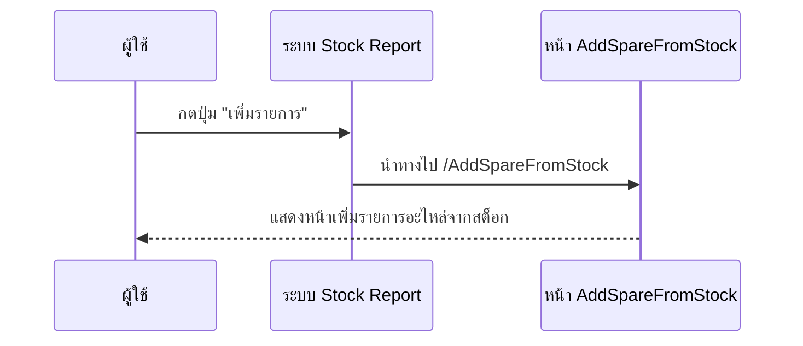

# StockReport - Sequence Diagram (ภาพรวม)

## 1. เปิดหน้า Stock Report (โหลดข้อมูล)

```mermaid
sequenceDiagram
    participant U as ผู้ใช้
    participant SR as ระบบ Stock Report
    participant API as Backend API
    participant DB as ฐานข้อมูล

    U->>SR: เปิดหน้า Stock Report
    SR->>API: ดึงข้อมูลรายงานสต็อก (GET /WorkOrderList/stockReport)
    API->>DB: Query ข้อมูล Stock Report ทั้งหมด
    DB-->>API: ส่งข้อมูลกลับ
    API-->>SR: รายการ Stock Report + Work Center + สถานะอนุมัติ
    SR-->>U: แสดงตาราง + KPI (จำนวนรายการ, Work Center, ช่วงวันที่)
```

---

## 2. ค้นหาและกรอง Stock Report

```mermaid
sequenceDiagram
    participant U as ผู้ใช้
    participant SR as ระบบ Stock Report

    U->>SR: ค้นหา / กรอง (Work Center, Plant, สถานะอนุมัติ)
    SR->>SR: กรองข้อมูลจากรายการที่โหลดไว้แล้ว
    SR-->>U: แสดงผลลัพธ์ที่กรองแล้ว + อัปเดต KPI
```

---

## 3. ดูรายละเอียดรายการ

```mermaid
sequenceDiagram
    participant U as ผู้ใช้
    participant SR as ระบบ Stock Report
    participant Detail as หน้า StockReportItem

    alt ดับเบิลคลิกแถว
        U->>SR: ดับเบิลคลิกแถวรายการ
        SR-->>U: แสดง Dialog รายละเอียด (ID, Work Center, Plant, เวลา)
    else กดปุ่มรายละเอียด
        U->>SR: กดปุ่ม "รายละเอียด"
        SR->>Detail: นำทางไป /StockReportItem/{resId}
        Detail-->>U: แสดงหน้ารายละเอียดเต็ม
    end
```

---

## 4. เพิ่มรายการใหม่

```mermaid
sequenceDiagram
    participant U as ผู้ใช้
    participant SR as ระบบ Stock Report
    participant Add as หน้า AddSpareFromStock

    U->>SR: กดปุ่ม "เพิ่มรายการ"
    SR->>Add: นำทางไป /AddSpareFromStock
    Add-->>U: แสดงหน้าเพิ่มรายการอะไหล่จากสต็อก
```
