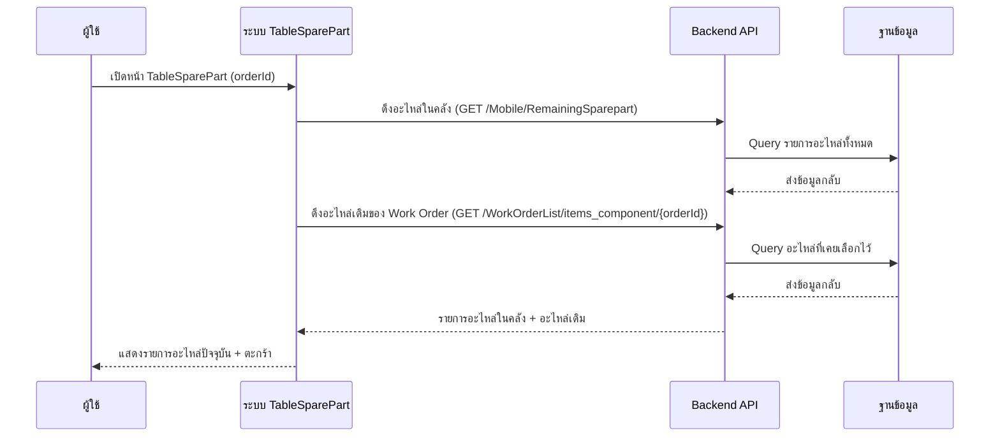
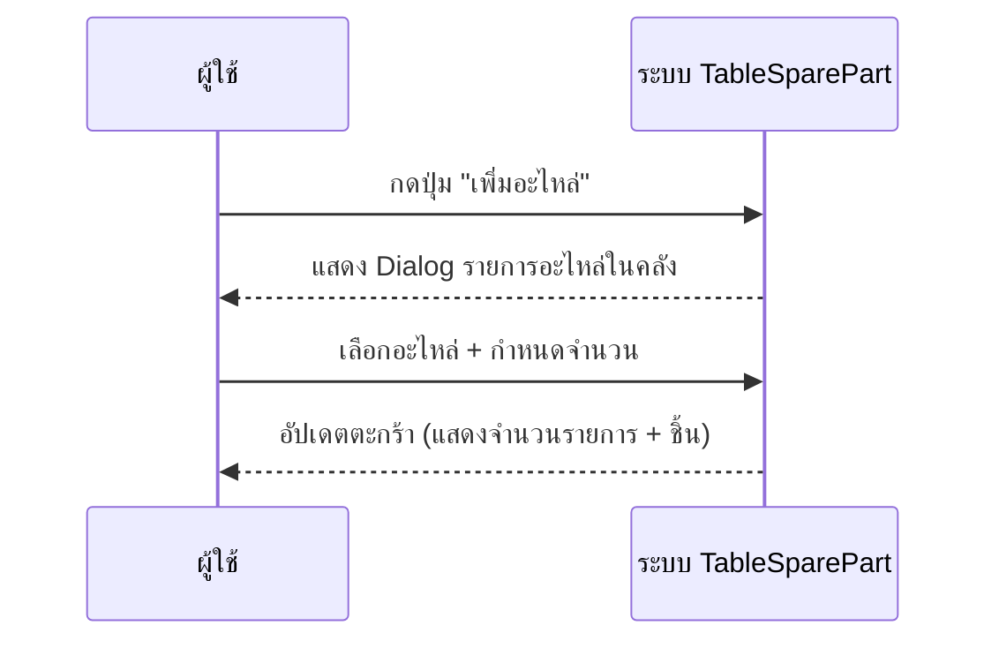
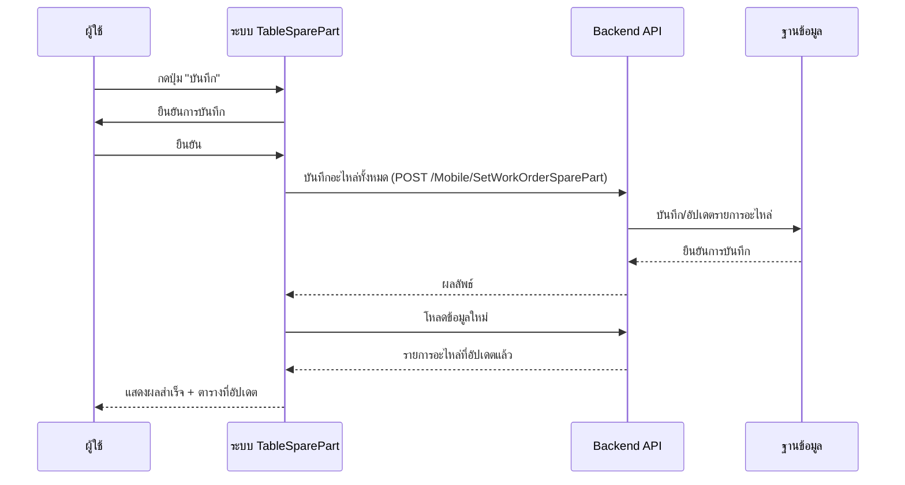
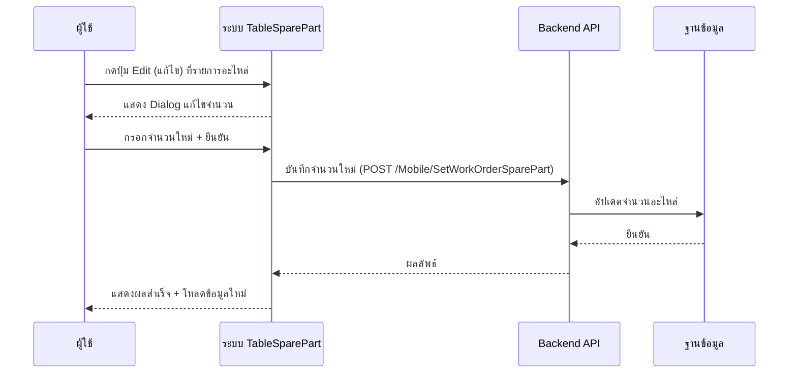
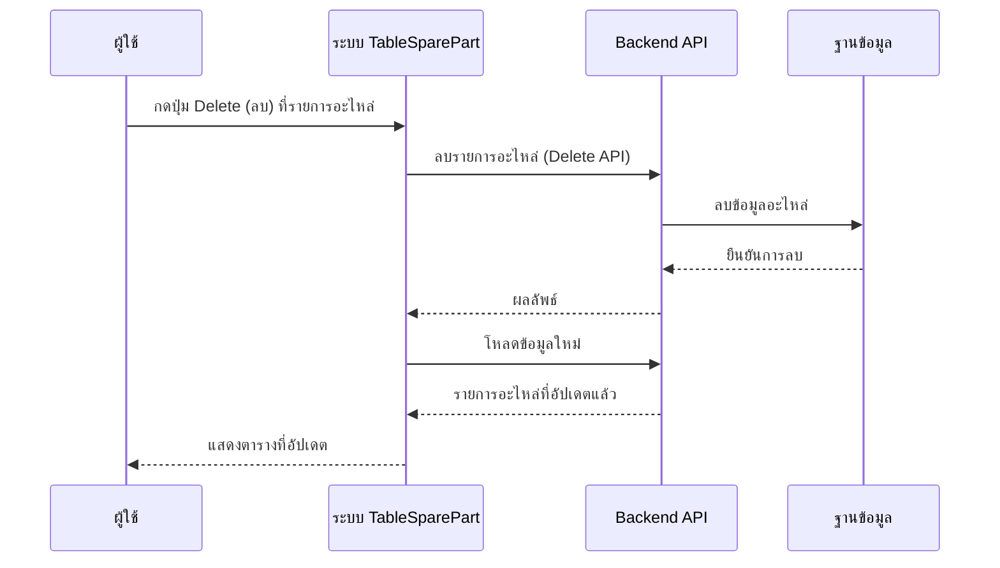

# TableSparePart - Sequence Diagram (ภาพรวม)

## 1. เปิดหน้า Spare Part (โหลดข้อมูล)

---

## 2. เพิ่มอะไหล่จากคลัง

---

## 3. บันทึกรายการอะไหล่ทั้งหมด

---

## 4. แก้ไขจำนวนอะไหล่

---

## 5. ลบรายการอะไหล่

