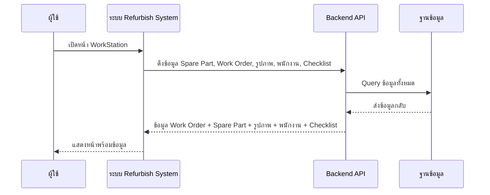
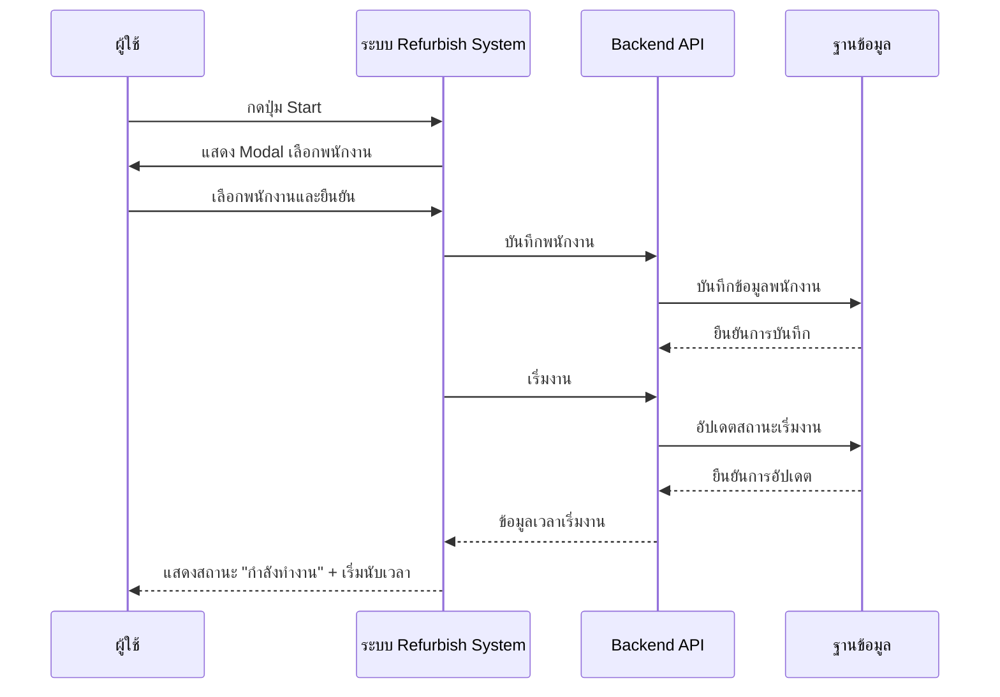
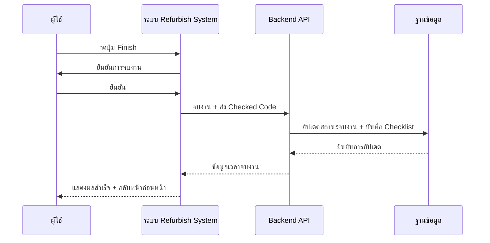
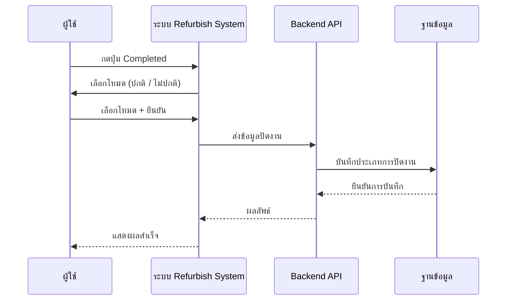
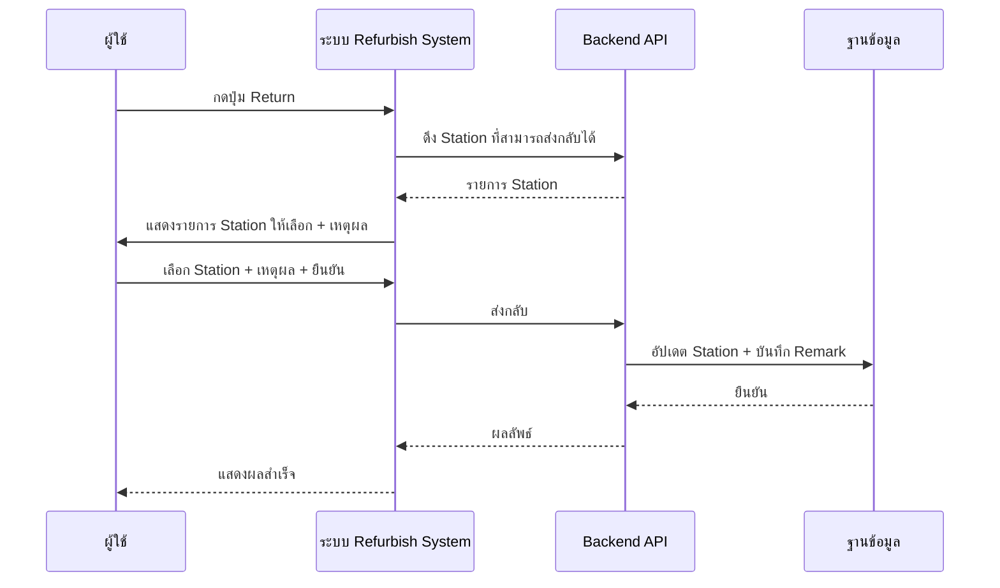
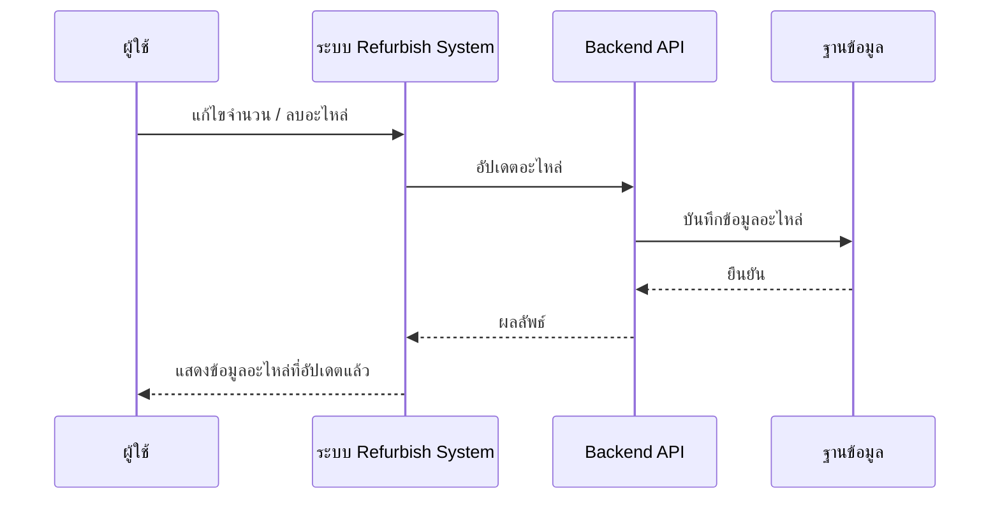
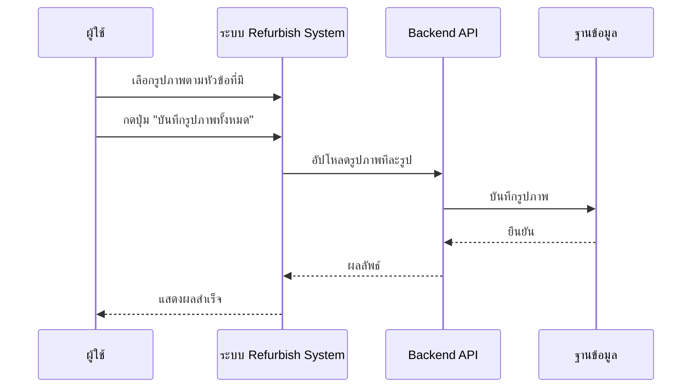
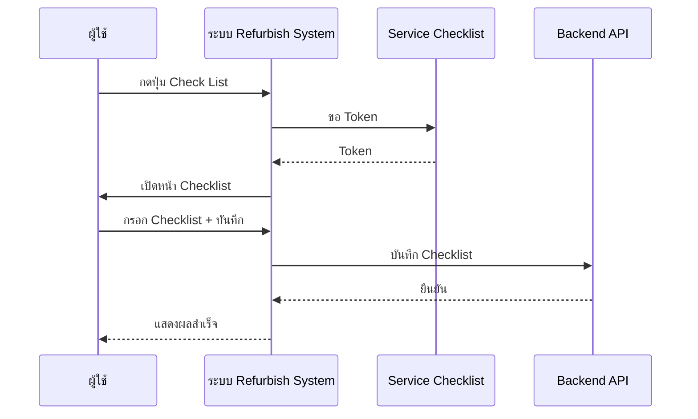

# WorkStation - Sequence Diagram (ภาพรวม)

## 1. เปิดหน้า WorkStation (Page Load)

---

## 2. เริ่มงาน (Start Work)

---

## 3. จบงาน (Finish Work)

---

## 4. ปิดงานสมบูรณ์ (Completed / Close Work)

---

## 5. ส่งงานกลับ (Return Work)

---

## 6. จัดการอะไหล่ (Spare Part)

---

## 7. อัปโหลดรูปภาพ (Upload Image)

---

## 8. เปิด Checklist (Station 0010, 0030, 0070)

